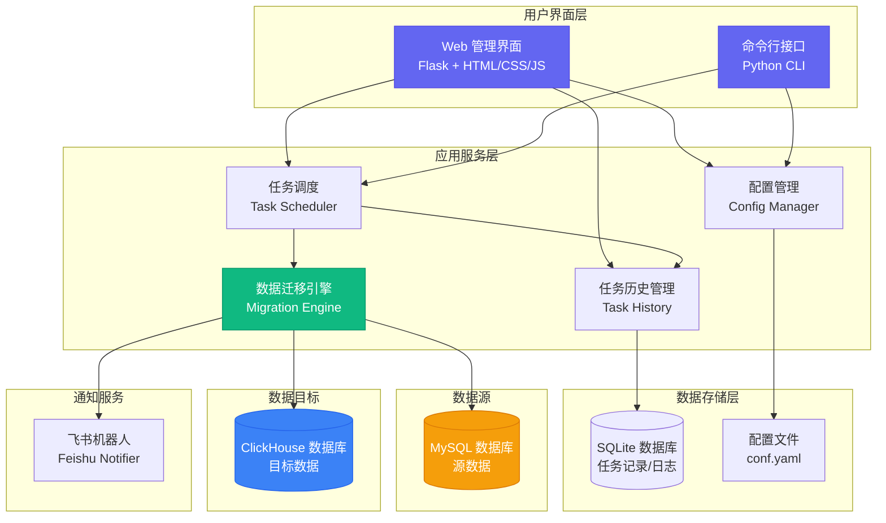
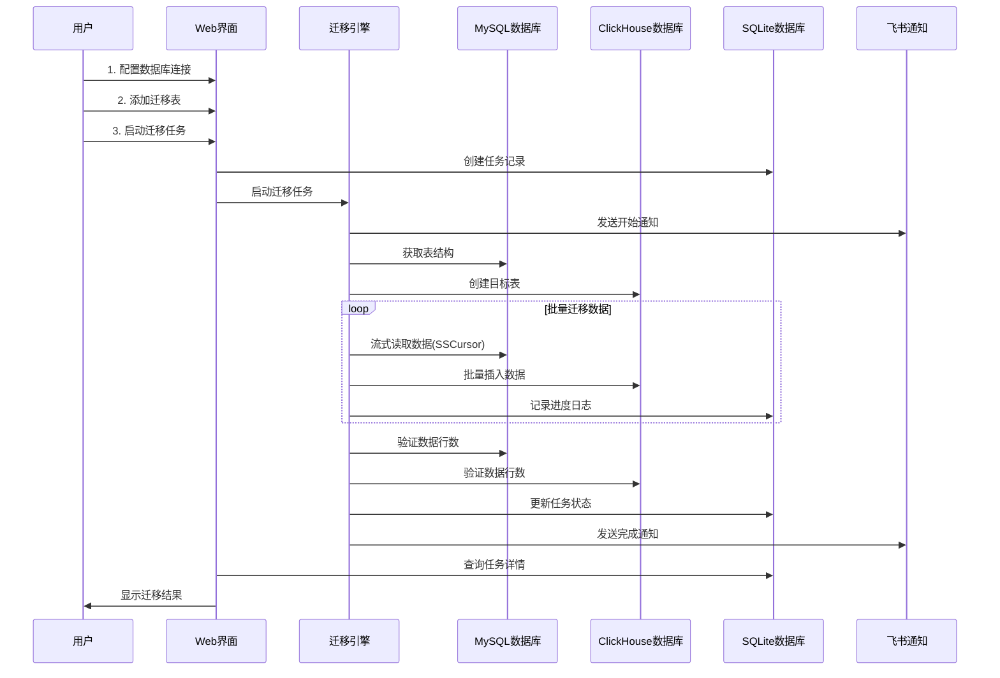

# MySQL to ClickHouse 数据迁移工具

[](https://www.python.org/)
[](LICENSE)
[](https://flask.palletsprojects.com/)

一个功能强大、易于使用的 MySQL 到 ClickHouse 数据迁移工具，支持 Web 界面管理和命令行执行，适用于大规模数据迁移场景。

## ✨ 功能特性

### 核心功能
- 🚀 **高性能迁移**：采用流式读取和批量插入，支持大规模数据迁移
- 📊 **Web 管理界面**：现代化的 Web UI，可视化配置和任务管理
- 📝 **任务历史记录**：完整的任务执行历史，支持日志查看和状态跟踪
- ✅ **数据验证**：自动验证迁移数据的完整性和一致性
- 🔔 **飞书通知**：支持飞书机器人通知，实时了解任务状态

### 技术特性
- **流式处理**：使用 SSCursor 避免内存溢出，支持超大表迁移
- **断点续传**：支持错误处理和继续执行
- **性能优化**：可配置批次大小、连接超时等参数
- **类型映射**：自动处理 MySQL 到 ClickHouse 的数据类型转换
- **表结构同步**：自动创建 ClickHouse 表结构


## 技术架构

### 系统架构图



### 数据迁移流程




## 📦 安装

### 环境要求
- Python 3.7+
- MySQL 数据库
- ClickHouse 数据库

### 安装步骤

1. **克隆仓库**
```bash
git clone https://github.com/your-username/mysql_to_clickhouse.git
cd mysql_to_clickhouse
```

2. **安装依赖**
```bash
pip install -r requirements.txt
```

3. **配置数据库连接**
```bash
cp conf.yaml-template conf.yaml
# 编辑 conf.yaml 文件，填写数据库连接信息
```

## 🚀 快速开始

### 方式一：Web 界面（推荐）

1. **启动 Web 服务**
```bash
python app.py
```

2. **访问 Web 界面**
打开浏览器访问：`http://127.0.0.1:5000`


4. **配置和启动**
   - 在配置页面填写 MySQL 和 ClickHouse 连接信息
   - 添加要迁移的表
   - 点击"启动迁移任务"开始迁移

### 方式二：命令行

1. **编辑配置文件**
```bash
vim conf.yaml
```

2. **运行迁移**
```bash
python mysql_to_clickhouse.py
```

## 📖 配置说明

### 配置文件结构

配置文件 `conf.yaml` 包含以下主要部分：

```yaml
# MySQL 数据库配置
mysql:
  host: "your-mysql-host"
  port: 3306
  user: "your-username"
  password: "your-password"
  database: "your-database"
  charset: "utf8mb4"

# ClickHouse 数据库配置
clickhouse:
  host: "your-clickhouse-host"
  port: 8123
  user: "default"
  password: "your-password"
  database: "your-database"

# 迁移任务配置
migration:
  tables:
    - mysql_table: "source_table"
      ch_table: "target_table"
      batch_size: 10000
      verify: true
```

详细配置说明请参考 `conf.yaml-template` 文件。

## 🎯 使用场景

- **数据仓库迁移**：将 MySQL 数据迁移到 ClickHouse 进行分析
- **数据同步**：定期同步 MySQL 数据到 ClickHouse
- **数据备份**：将 MySQL 数据备份到 ClickHouse
- **性能优化**：将查询频繁的数据迁移到 ClickHouse 提升性能

## 📊 Web 界面功能

### 配置管理
- 可视化配置数据库连接
- 批量配置迁移表
- 实时保存配置

### 任务管理
- 查看所有迁移任务历史
- 实时查看任务执行状态
- 查看详细的执行日志
- 查看每个表的迁移详情


### 任务详情
- 任务基本信息（状态、时间、统计）
- 表迁移详情（行数、速度、验证结果）
- 完整执行日志
- 配置快照


## 🔧 高级功能

### 性能调优
- 调整批次大小：根据数据量和网络情况调整 `batch_size`
- 连接超时设置：配置 `connection_timeout` 和 `read_timeout`
- MySQL 获取大小：调整 `mysql_fetch_size` 优化读取性能


### 错误处理
- `continue_on_error: true`：遇到错误时继续执行其他表
- `skip_empty_tables: true`：自动跳过空表
- 详细的错误日志记录


### 飞书通知
配置飞书机器人 Webhook，支持：
- 任务开始通知
- 任务成功通知
- 任务失败通知
- 进度更新通知（可选）


## 📁 项目结构

```
mysql_to_clickhouse/
├── app.py                    # Flask Web 应用
├── database.py               # SQLite 数据库管理
├── mysql_to_clickhouse.py    # 核心迁移逻辑
├── feishu_notifier.py        # 飞书通知模块
├── conf.yaml                 # 配置文件（需自行创建）
├── conf.yaml-template        # 配置模板
├── requirements.txt          # Python 依赖
├── templates/                # Web 模板
│   ├── base.html
│   ├── index.html
│   ├── tasks.html
│   └── task_detail.html
└── README.md                 # 项目说明
```

## 🛠️ 技术栈

- **后端框架**：Flask 3.0
- **数据库驱动**：pymysql, clickhouse-connect
- **数据存储**：SQLite（任务记录）
- **前端技术**：HTML5, CSS3, JavaScript
- **配置管理**：PyYAML

## 📝 使用示例

### 迁移单个表
```yaml
migration:
  tables:
    - mysql_table: "users"
      ch_table: "users"
      batch_size: 10000
      verify: true
```

### 迁移多个表
```yaml
migration:
  tables:
    - mysql_table: "users"
      ch_table: "users"
    - mysql_table: "orders"
      ch_table: "orders"
    - mysql_table: "products"
      ch_table: "products"
```

### 自定义批次大小
```yaml
migration:
  default_batch_size: 50000  # 增大批次大小提升性能
```

## ⚠️ 注意事项

1. **数据备份**：迁移前请确保数据已备份
2. **网络稳定**：大规模迁移需要稳定的网络连接
3. **资源监控**：迁移过程中注意监控数据库和服务器资源
4. **权限要求**：确保 MySQL 和 ClickHouse 用户有足够的权限
5. **字符集**：建议使用 `utf8mb4` 字符集以支持完整的 Unicode

## 🤝 贡献

欢迎提交 Issue 和 Pull Request！

1. Fork 本仓库
2. 创建特性分支 (`git checkout -b feature/AmazingFeature`)
3. 提交更改 (`git commit -m 'Add some AmazingFeature'`)
4. 推送到分支 (`git push origin feature/AmazingFeature`)
5. 开启 Pull Request

## 📄 许可证

本项目采用 MIT 许可证 - 查看 [LICENSE](LICENSE) 文件了解详情

## 🙏 致谢

感谢所有为本项目做出贡献的开发者！

## 📮 联系方式

如有问题或建议，请提交 Issue 或联系维护者。

---

⭐ 如果这个项目对你有帮助，请给个 Star！

